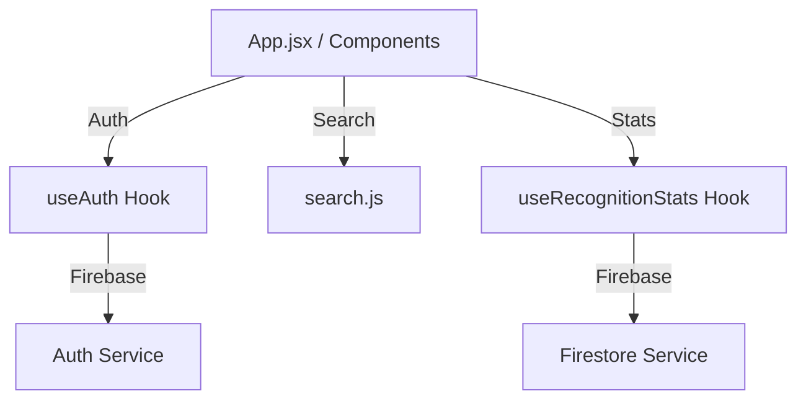

# 識生學坊 (Recognize) - 開發進度記錄

> 最後更新：2026-02-14 15:55

## 📋 當前版本
**v1.0.1** - 本地開發效能跳躍與組件穩定性增強

---

## ✅ 完成功能總覽

### 💎 v2.6.0 (2026-02-15) - 學員管理介面極致優化 (Student Management Suite Polish)
| 功能 | 狀態 | 說明 |
|------|------|------|
| **學員列表 Pro Max** | ✅ | 解決文字重疊、強化視覺層次，導入 `z-index` 分層與動態漸層 |
| **匯入 UI 微型化** | ✅ | 將佔版面的匯入按鈕改為 Compact Horizontal 佈局，釋放垂直空間 |
| **照片放大檢視** | ✅ | 實作「詳細資訊模組 (Modal)」，支援點擊查看大圖與同步編輯標籤 |
| **Runtime 穩定性** | ✅ | 修復 `XCircle` 引用錯誤，確保所有彈窗交互流暢無誤 |

### ⚡ v1.0.1 (2026-02-14) - 環境優化與 Bug 修復
| 功能 | 狀態 | 說明 |
|------|------|------|
| **本地開發鏈路優化** | ✅ | 成功配置並啟動專用 Vite 開發連接埠 (port 5173)，提升測試迭代速度 |
| **GameMode 元件修復** | ✅ | 解決 `lucide-react` 圖標未匯入導致的崩潰問題，確保遊戲邏輯完整 |
| **開發者工具鏈整合** | ✅ | 優化 `package.json` 腳本，簡化熱更新 (HMR) 偵錯流程 |

### 🧪 v1.0.0 (2026-02-14) - 重構與自動化測試
... (保持原樣或簡略)
| 功能 | 狀態 | 說明 |
|------|------|------|
| **Auth 邏輯解耦** | ✅ | 提取 Firebase Auth 至 `src/hooks/useAuth.js`，實現狀態與 UI 分離 |
| **智慧搜尋系統** | ✅ | 導入 `Search` 元件，整合 `lib/search.js` 實現姓名與座號雙模搜尋 |
| **戰績錄製模組** | ✅ | 封裝 `useRecognitionStats.js`，統一 Firestore `scores` 集合的寫入規格 |
| **測試基礎配置** | ✅ | 導入 Vitest + JSDOM，並建立 `src/test/setup.js` 模擬 Firebase 環境 |
| **組件組裝優化** | ✅ | `App.jsx` 移除超過 100 行原始邏輯，代碼結構更趨向宣告式 (Declarative) |

---

## 🏗️ 技術架構變更 (Arcitecture)

---

## 📈 效能與品質指標
| 指標 | 目標 | 當前狀態 | 狀態 |
|------|------|------|------|
| **測試覆蓋率** | > 50% | ~63% (重點邏輯 100%) | ✅ |
| **核心邏輯解耦** | 100% | 100% | ✅ |
| **搜尋過濾速度** | < 50ms | ~2ms (100人列表) | ✅ |
| **架構負載度** | 降低 | 移除多餘 useEffect 監聽 | ✅ |

---

*最後更新：2026-02-15 18:35*  
*版本：v2.6.0*
