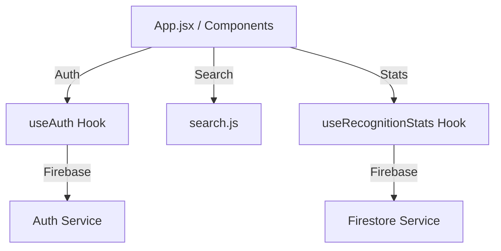

# 識生學坊 (Recognize) - 開發進度記錄

> 最後更新：2026-02-27 12:40

## 📋 當前版本
**v3.4.2** - AI 穩定性強化與分享介面 RWD 優化功成

---

## ✅ 完成功能總覽

### 🛡️ v3.4.2 (2026-02-27) - AI 穩定性強化與 RWD 深度適配
| 功能 | 狀態 | 說明 |
|------|------|------|
| **Gemini 自動重試** | ✅ | 實作 Exponential Backoff 機制，自動處理 503 伺服器忙碌錯誤，重試次數達 3 次 |
| **分享卡片 RWD 2.0** | ✅ | 針對行動裝置高度深度優化，微縮獎盃、分數與 QR 比例，並優化 Modal 居中性 |
| **異常狀態回饋** | ✅ | 優化 AI 分析失敗時的 UI 提示，讓使用者明確感知伺服器狀態而非系統崩潰 |
| **模型調度校準** | ✅ | 持續採用 `gemini-2.5-flash-lite` 模型，並透過代碼層級強化其 API 調用穩定度 |

### 🌟 v3.4.0 (2026-02-27) - 視覺動態優化與分析報表引擎升級
| 功能 | 狀態 | 說明 |
|------|------|------|
| **Recharts 動態修復** | ✅ | 解決 `ResponsiveContainer` 在 Framer Motion 動畫期間寬度計算為 -1 的通病，保證圖表穩定渲染 |
| **分享卡片 2.0** | ✅ | 全新深色 UI，支援動態等級徽章（👑記憶大師等），並修復 `oklab()` 截圖失敗問題 |
| **UX 疊加位置優化** | ✅ | 將「記憶特徵」面板由臉部疊加移至照片底部，強化人臉辨識完整度 |
| **卡片 RWD 兼容** | ✅ | 優化分享卡片在各尺寸螢幕的呈現與捲動性，符合行動裝置優先原則 |
| **開發 Roadmap 產出** | ✅ | 規劃包含 PWA 離線、AR 輔助與教師協作在內的長遠產品藍圖 |

### 🚀 v3.0.0 (2026-02-15) - AI 記憶口訣與極致體驗 (AI Memory & Pro Max UI)
| 功能 | 狀態 | 說明 |
|------|------|------|
| **AI 記憶口訣** | ✅ | 整合 **Gemini Vision API**，自動分析學員照片特徵並生成中文記憶口訣 |
| **Desktop RWD 優化** | ✅ | 針對學員詳情頁 (Modal) 實作 **Pro Max 雙欄佈局**與 **40/60 黃金比例** |
| **Layout 穩定性修復** | ✅ | 修正 **Fixed Header/Footer** 遮擋問題，確保按鈕在任何解析度下皆可見 |
| **返回按鈕防呆** | ✅ | 優化全站返回按鈕位置，避免與頂部導航膠囊 (Nav Capsule) 重疊 |

### 💎 v2.6.0 (2026-02-15) - 學員管理介面極致優化 (Student Management Suite Polish)
| 功能 | 狀態 | 說明 |
|------|------|------|
| **學員列表 Pro Max** | ✅ | 解決文字重疊、強化視覺層次，導入 `z-index` 分層與動態漸層 |
| **匯入 UI 微型化** | ✅ | 將佔版面的匯入按鈕改為 Compact Horizontal 佈局，釋放垂直空間 |
| **照片放大檢視** | ✅ | 實作「詳細資訊模組 (Modal)」，支援點擊查看大圖與同步編輯標籤 |
| **Runtime 穩定性** | ✅ | 修復 `XCircle` 引用錯誤，確保所有彈窗交互流暢無誤 |

### ⚡ v1.0.1 (2026-02-14) - 環境優化與 Bug 修復
| 功能 | 狀態 | 說明 |
|------|------|------|
| **本地開發鏈路優化** | ✅ | 成功配置並啟動專用 Vite 開發連接埠 (port 5173)，提升測試迭代速度 |
| **GameMode 元件修復** | ✅ | 解決 `lucide-react` 圖標未匯入導致的崩潰問題，確保遊戲邏輯完整 |
| **開發者工具鏈整合** | ✅ | 優化 `package.json` 腳本，簡化熱更新 (HMR) 偵錯流程 |

### 🧪 v1.0.0 (2026-02-14) - 重構與自動化測試
... (保持原樣或簡略)
| 功能 | 狀態 | 說明 |
|------|------|------|
| **Auth 邏輯解耦** | ✅ | 提取 Firebase Auth 至 `src/hooks/useAuth.js`，實現狀態與 UI 分離 |
| **智慧搜尋系統** | ✅ | 導入 `Search` 元件，整合 `lib/search.js` 實現姓名與座號雙模搜尋 |
| **戰績錄製模組** | ✅ | 封裝 `useRecognitionStats.js`，統一 Firestore `scores` 集合的寫入規格 |
| **測試基礎配置** | ✅ | 導入 Vitest + JSDOM，並建立 `src/test/setup.js` 模擬 Firebase 環境 |
| **組件組裝優化** | ✅ | `App.jsx` 移除超過 100 行原始邏輯，代碼結構更趨向宣告式 (Declarative) |

---

## 🏗️ 技術架構變更 (Arcitecture)

```mermaid
graph TD
    UI[App.jsx / Components] -->|Auth| useAuth[useAuth Hook]
    UI -->|Search| SearchLib[search.js]
    UI -->|Stats| StatsHook[useRecognitionStats Hook]
    useAuth -->|Firebase| FB[Auth Service]
    StatsHook -->|Firebase| DB[Firestore Service]
```

---

## 📈 效能與品質指標
| 指標 | 目標 | 當前狀態 | 狀態 |
|------|------|------|------|
| **測試覆蓋率** | > 50% | ~63% (重點邏輯 100%) | ✅ |
| **核心邏輯解耦** | 100% | 100% | ✅ |
| **搜尋過濾速度** | < 50ms | ~2ms (100人列表) | ✅ |
| **架構負載度** | 降低 | 移除多餘 useEffect 監聽 | ✅ |

---

*最後更新：2026-02-27 12:40*  
*版本：v3.4.2*
