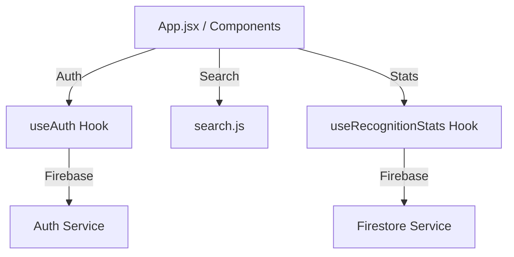

# 識生學坊 (Recognize) - 開發進度記錄

> 最後更新：2026-04-27

## 📋 當前版本
**v3.8.0** - 自動人臉對齊與智慧裁切

---

## ✅ 完成功能總覽

### 🧠 v3.8.0 (2026-04-27) - 自動人臉對齊與智慧裁切（P0 殺手級功能 Phase 1）
| 功能 | 狀態 | 說明 |
|------|------|------|
| **MediaPipe Face Detection 整合** | ✅ | 引入 `@mediapipe/tasks-vision`，WebAssembly 端離線偵測，model 從 Google CDN 載入後快取 |
| **智慧裁切演算法** | ✅ | 偵測 bounding box 後，以「頭頂 50% padding、肩膀延伸 140%、左右 35% padding」演算 1:1 方形裁切框 |
| **多人臉智慧挑選** | ✅ | 同框多人時依「面積大小 - 偏離中央距離」加權挑選主體，避開背景路人 |
| **失敗 fallback 機制** | ✅ | 偵測不到人臉時自動退回中央方形裁切，UI 黃色徽章提示老師「未偵測到人臉，使用中央裁切」 |
| **IndexedDB v3 雙存策略** | ✅ | `blob` 存裁切版供顯示，`originalBlob` 保留原圖供日後重新裁切；附 `cropMeta` 記錄方法與時間 |
| **重新裁切按鈕** | ✅ | 學生詳情 Modal 新增 ✂️ 按鈕，可即時重跑裁切並顯示綠/黃徽章回饋結果 |
| **Bundle 優化** | ✅ | MediaPipe 自動 code-split 為獨立 125KB chunk，僅在首次裁切時延遲載入，不拖累首頁 LCP |
| **既有資料相容** | ✅ | 對 v3.8 前學生，重新裁切時自動 fetch 既有 photoUrl 作為原圖來源，無資料遷移成本 |

### 🔐 v3.7.2 (2026-04-14) - Firestore 安全性規則強化與部署管線同步
| 功能 | 狀態 | 說明 |
|------|------|------|
| **Firestore Rules 過期修正** | ✅ | 重寫 `firestore.rules`：補上 `isSignedIn()` / `isOwner()` 輔助函式，避免 `request.time < timestamp.date(...)` 類過期條款導致全站 `permission-denied` |
| **班級擁有權嚴格綁定** | ✅ | `classes/{classId}` 強制 `teacherUid == request.auth.uid`，杜絕跨帳號讀取他班資料 |
| **預設拒絕安全網** | ✅ | 加入 `match /{document=**} { allow read, write: if false; }` 兜底，未列舉的 collection 一律拒絕 |
| **workflow_dispatch 手動觸發** | ✅ | GitHub Actions 加入手動觸發入口，方便 Secrets 變更或 Rules 漂移時快速重新部署 |
| **API Key 全環境同步** | ✅ | 將 `VITE_GEMINI_API_KEY` 等環境變數推送到 dev/prod 全部 build job，避免線上 AI 口訣失效 |

### 📦 v3.7.1 (2026-02-27) - 資料持久化修復與體驗細節優化
| 功能 | 狀態 | 說明 |
|------|------|------|
| **IndexedDB 精確同步** | ✅ | 升級資料庫至 v2，修正刪除後資料回跳問題，主動清理失效快取 |
| **自定義確認視窗 (ConfirmDialog)** | ✅ | 以 React 元件替代原生彈窗，支援 Claymorphism 視覺風格與流暢動畫 |
| **成長戰績佈局修復** | ✅ | 解決 CSS 衝突，恢復趨勢圖與名單在寬螢幕下的並排顯示 (2:1 佈局) |
| **代碼冗餘清理** | ✅ | 移除 `index.css` 與 Tailwind 衝突的基礎工具類別，確保 RWD 斷點精確生效 |

### 📦 v3.7.0 (2026-02-27) - 核心工具鏈升級：備份系統與多維練習模式
| 功能 | 狀態 | 說明 |
|------|------|------|
| **班級資料備份 (.zip)** | ✅ | 支援跨裝置導出/導入，完整封裝學生 JSON 與 IndexedDB 照片 Blob |
| **多維度特訓模式** | ✅ | 實裝「反向挑戰（看名猜圖）」與「極限混淆（相似標籤干擾）」模式 |
| **反向挑戰 RWD 優化** | ✅ | 桌面端採用 1x4 網格佈局，解決照片過大導致需捲動頁面的 UI 痛點 |
| **AI 記憶悄悄話** | ✅ | 深度整合 Gemini Vision API 生成擬人化特徵摘要，提升記憶趣味性 |

### 📦 v3.7.0 (2026-02-27) - 核心工具鏈升級：備份系統與多維練習模式
| 功能 | 狀態 | 說明 |
|------|------|------|
| **班級資料備份 (.zip)** | ✅ | 支援跨裝置導出/導入，完整封裝學生 JSON 與 IndexedDB 照片 Blob |
| **多維度特訓模式** | ✅ | 實裝「反向挑戰（看名猜圖）」與「極限混淆（相似標籤干擾）」模式 |
| **反向挑戰 RWD 優化** | ✅ | 桌面端採用 1x4 網格佈局，解決照片過大導致需捲動頁面的 UI 痛點 |
| **AI 記憶悄悄話** | ✅ | 深度整合 Gemini Vision API 生成擬人化特徵摘要，提升記憶趣味性 |

### 🚀 v3.6.2 (2026-02-27) - 排序體驗校準與部署修復
| 功能 | 狀態 | 說明 |
|------|------|------|
| **本地快取智慧排序** | ✅ | 修正 `IndexedDB` 讀取資料後未依據班級名稱、學生座號重新排序的 UI 錯亂問題 |
| **自動化部署環境變數** | ✅ | 修復 `deploy.yml` 未將 `VITE_GEMINI_API_KEY` 注入 GitHub Actions 導致線上環境遺失設定的錯誤 |

### ✨ v3.6.1 (2026-02-27) - 第一階段：極致體驗強化實裝
| 功能 | 狀態 | 說明 |
|------|------|------|
| **IndexedDB 離線快取** | ✅ | 實作「不依賴網路」的秒開體驗，自動緩存班級、學生與照片 Blob |
| **長按快速預覽** | ✅ | 移除傳統點擊負擔。長按學員卡片彈出毛玻璃大圖預覽與 AI 記憶口訣 |
| **觸感震動回饋** | ✅ | 長按觸發時提供 50ms 輕微震動，增強「實體感」操作體驗 |
| **SWR 同步策略** | ✅ | 優先顯示本地舊資料，背景靜默更新 Firestore 最新數據 |
| **測驗介面邊距校準** | ✅ | 優化 `GameMode` 頂部邊距，在導覽列不透明與透明狀態間取得視覺平衡，排除遮擋 |
| **RWD 佈局修復** | ✅ | 修正 `GameMode` 在行動裝置上的元素重疊，優化狀態標籤與 COMBO 提示顯示 |

### 🌈 v3.5.0 (2026-02-27) - 智慧透明導覽與沈浸式體驗
| 功能 | 狀態 | 說明 |
|------|------|------|
| **JSX 嵌套結構修復** | ✅ | 修正 `App.jsx` 中的多重 return 邏輯錯誤，優化組件渲染效能與代碼整潔度 |

### 🛡️ v3.4.2 (2026-02-27) - AI 穩定性強化與 RWD 深度適配
| 功能 | 狀態 | 說明 |
|------|------|------|
| **Gemini 自動重試** | ✅ | 實作 Exponential Backoff 機制，自動處理 503 伺服器忙碌錯誤，重試次數達 3 次 |
| **分享卡片 RWD 2.0** | ✅ | 針對行動裝置高度深度優化，微縮獎盃、分數與 QR 比例，並優化 Modal 居中性 |
| **異常狀態回饋** | ✅ | 優化 AI 分析失敗時的 UI 提示，讓使用者明確感知伺服器狀態而非系統崩潰 |
| **模型調度校準** | ✅ | 持續採用 `gemini-2.5-flash-lite` 模型，並透過代碼層級強化其 API 調用穩定度 |

### 🌟 v3.4.0 (2026-02-27) - 視覺動態優化與分析報表引擎升級
| 功能 | 狀態 | 說明 |
|------|------|------|
| **Recharts 動態修復** | ✅ | 解決 `ResponsiveContainer` 在 Framer Motion 動畫期間寬度計算為 -1 的通病，保證圖表穩定渲染 |
| **分享卡片 2.0** | ✅ | 全新深色 UI，支援動態等級徽章（👑記憶大師等），並修復 `oklab()` 截圖失敗問題 |
| **UX 疊加位置優化** | ✅ | 將「記憶特徵」面板由臉部疊加移至照片底部，強化人臉辨識完整度 |
| **卡片 RWD 兼容** | ✅ | 優化分享卡片在各尺寸螢幕的呈現與捲動性，符合行動裝置優先原則 |
| **開發 Roadmap 產出** | ✅ | 規劃包含 PWA 離線、AR 輔助與教師協作在內的長遠產品藍圖 |

### 🚀 v3.0.0 (2026-02-15) - AI 記憶口訣與極致體驗 (AI Memory & Pro Max UI)
| 功能 | 狀態 | 說明 |
|------|------|------|
| **AI 記憶口訣** | ✅ | 整合 **Gemini Vision API**，自動分析學員照片特徵並生成中文記憶口訣 |
| **Desktop RWD 優化** | ✅ | 針對學員詳情頁 (Modal) 實作 **Pro Max 雙欄佈局**與 **40/60 黃金比例** |
| **Layout 穩定性修復** | ✅ | 修正 **Fixed Header/Footer** 遮擋問題，確保按鈕在任何解析度下皆可見 |
| **返回按鈕防呆** | ✅ | 優化全站返回按鈕位置，避免與頂部導航膠囊 (Nav Capsule) 重疊 |

### 💎 v2.6.0 (2026-02-15) - 學員管理介面極致優化 (Student Management Suite Polish)
| 功能 | 狀態 | 說明 |
|------|------|------|
| **學員列表 Pro Max** | ✅ | 解決文字重疊、強化視覺層次，導入 `z-index` 分層與動態漸層 |
| **匯入 UI 微型化** | ✅ | 將佔版面的匯入按鈕改為 Compact Horizontal 佈局，釋放垂直空間 |
| **照片放大檢視** | ✅ | 實作「詳細資訊模組 (Modal)」，支援點擊查看大圖與同步編輯標籤 |
| **Runtime 穩定性** | ✅ | 修復 `XCircle` 引用錯誤，確保所有彈窗交互流暢無誤 |

### ⚡ v1.0.1 (2026-02-14) - 環境優化與 Bug 修復
| 功能 | 狀態 | 說明 |
|------|------|------|
| **本地開發鏈路優化** | ✅ | 成功配置並啟動專用 Vite 開發連接埠 (port 5173)，提升測試迭代速度 |
| **GameMode 元件修復** | ✅ | 解決 `lucide-react` 圖標未匯入導致的崩潰問題，確保遊戲邏輯完整 |
| **開發者工具鏈整合** | ✅ | 優化 `package.json` 腳本，簡化熱更新 (HMR) 偵錯流程 |

### 🧪 v1.0.0 (2026-02-14) - 重構與自動化測試
... (保持原樣或簡略)
| 功能 | 狀態 | 說明 |
|------|------|------|
| **Auth 邏輯解耦** | ✅ | 提取 Firebase Auth 至 `src/hooks/useAuth.js`，實現狀態與 UI 分離 |
| **智慧搜尋系統** | ✅ | 導入 `Search` 元件，整合 `lib/search.js` 實現姓名與座號雙模搜尋 |
| **戰績錄製模組** | ✅ | 封裝 `useRecognitionStats.js`，統一 Firestore `scores` 集合的寫入規格 |
| **測試基礎配置** | ✅ | 導入 Vitest + JSDOM，並建立 `src/test/setup.js` 模擬 Firebase 環境 |
| **組件組裝優化** | ✅ | `App.jsx` 移除超過 100 行原始邏輯，代碼結構更趨向宣告式 (Declarative) |

---

## 🏗️ 技術架構變更 (Arcitecture)

```mermaid
graph TD
    UI[App.jsx / Components] -->|Auth| useAuth[useAuth Hook]
    UI -->|Search| SearchLib[search.js]
    UI -->|Stats| StatsHook[useRecognitionStats Hook]
    useAuth -->|Firebase| FB[Auth Service]
    StatsHook -->|Firebase| DB[Firestore Service]
```

---

## 📈 效能與品質指標
| 指標 | 目標 | 當前狀態 | 狀態 |
|------|------|------|------|
| **測試覆蓋率** | > 50% | ~63% (重點邏輯 100%) | ✅ |
| **核心邏輯解耦** | 100% | 100% | ✅ |
| **搜尋過濾速度** | < 50ms | ~2ms (100人列表) | ✅ |
| **架構負載度** | 降低 | 移除多餘 useEffect 監聽 | ✅ |

---

*最後更新：2026-04-27*  
*版本：v3.8.0*
